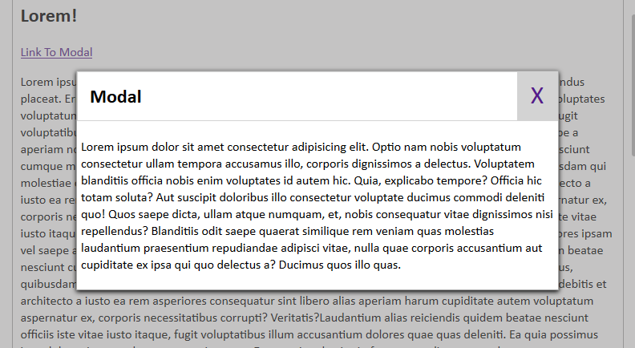

# Basic-JS-PopUp-Modal
## A Full **Responsive** Modal made with HTML5, CSS and JS.

Simple PopUp model easy to use, responsive on every screen size.

----------------------------------------------------------------
** TRY IT NOW: [Basic-JS-Modal](https://arslanameer.github.io/Ui-Component-Basic-JS-PopUp-Modal/)

## How To Use:
Copy code and files to your Project and Just Add your required content inside `modal-body` 
.

_(Arslan Ameer)_
